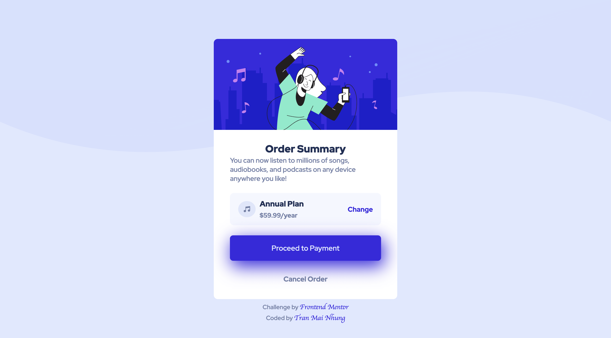

# Frontend Mentor - Order summary card solution

This is a solution to the [Order summary card challenge on Frontend Mentor](https://www.frontendmentor.io/challenges/order-summary-component-QlPmajDUj). Frontend Mentor challenges help you improve your coding skills by building realistic projects. 

## Table of contents

- [Overview](#overview)
  - [The challenge](#the-challenge)
  - [Screenshot](#screenshot)
  - [Links](#links)
- [My process](#my-process)
  - [Built with](#built-with)
  - [What I learned](#what-i-learned)
  - [Continued development](#continued-development)
- [Author](#author)

**Note: Delete this note and update the table of contents based on what sections you keep.**

## Overview

### The challenge

Users should be able to:

- See hover states for interactive elements

### Screenshot

Desktop window size:


Mobile window size:


### Links

- Solution URL: [My solution URL](https://www.frontendmentor.io/solutions/order-summary-component-challenge-hub-DDUHwjigY)
- Live Site URL: [My product URL](https://puppychan.github.io/OrderSummaryComponentChallengeHub/)

## My process

### Built with

- Semantic HTML5 markup
- CSS custom properties
- Flexbox
- Mobile-first workflow

### What I learned

I learned how to use flex box fluently, as well as using clamp() to adjust responsive easier.

To see how you can add code snippets, see below:

```css
.proud-of-this-css {
  display: flex;
  justify-content: center;
  align-items: center;
  gap: 3em;

  font-size: clamp(3em, 1.5vw, 5em);
}
```

### Continued development

I will create multiple cards like this and display in a grid in future.

## Author

- Website - [Tran Mai Nhung](https://github.com/Puppychan)
- Frontend Mentor - [@Puppychan](frontendmentor.io/profile/Puppychan)
